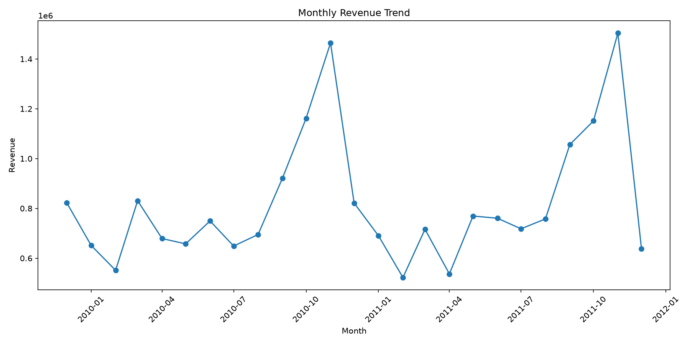
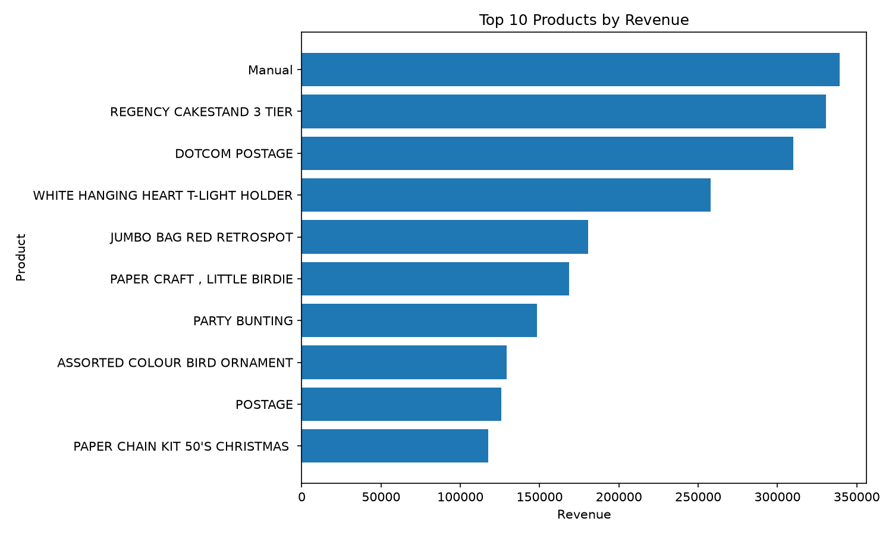
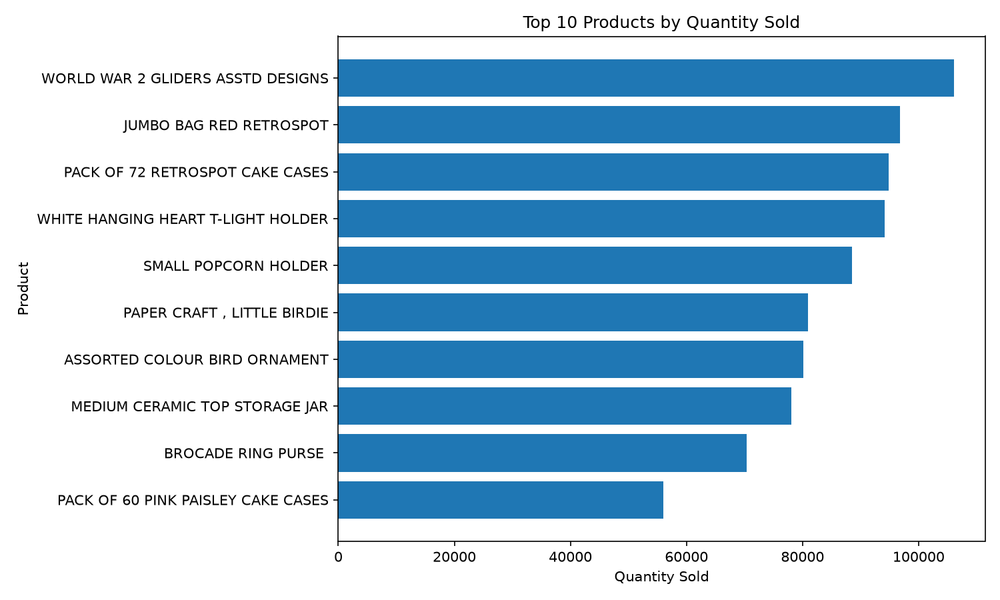
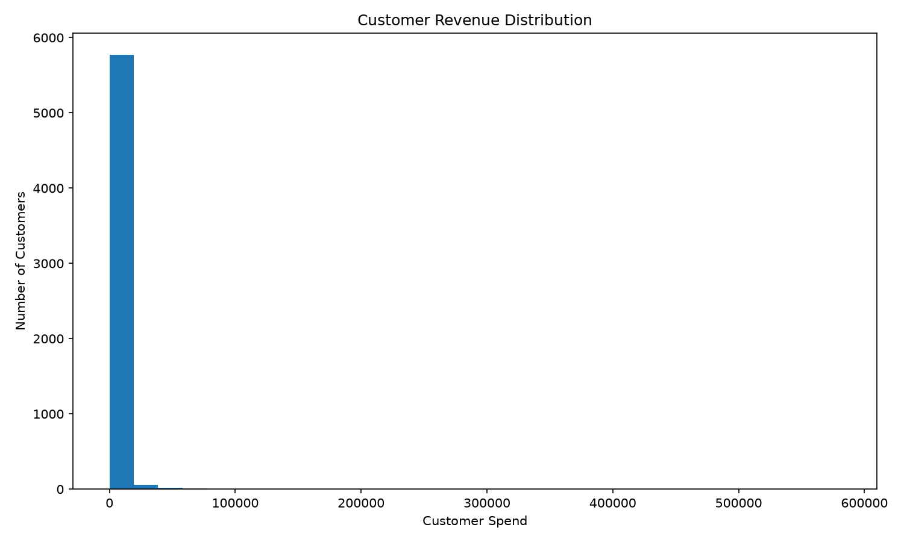
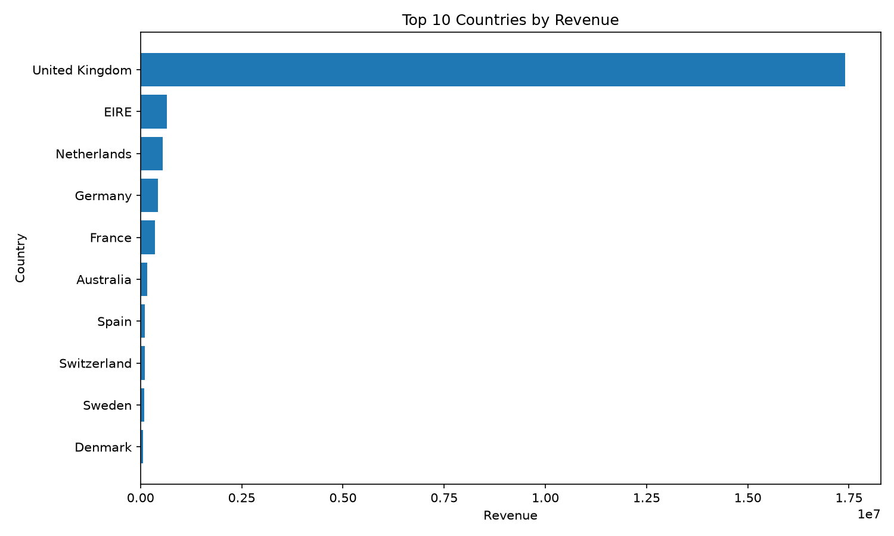

# Sales Analysis Report

## 1. Executive Summary

This report provides an analysis of sales performance across revenue,
orders, products, customers, and geographic markets.

### Key Findings

- **Total Revenue:** 20,476,260.45
- **Total Orders:** 40,077
- **Total Quantity Sold:** 11,205,148
- **Average Order Value:** 510.92
- **Number of Customers:** 5,878
- **Average Customer Spend:** 2,955.90

The highest-revenue product was **Manual**,
generating **339,226.24** in revenue.

The highest-revenue country was **United Kingdom**,
generating **17,410,196.12** in revenue.

The strongest revenue month was **2011-11**,
with revenue of **1,503,866.78**.

---

## 2. Sales Performance

### Overall KPIs

| Metric | Value |
|---|---:|
| Total Revenue | 20,476,260.45 |
| Total Orders | 40,077 |
| Total Quantity Sold | 11,205,148 |
| Average Order Value | 510.92 |
| Number of Customers | 5,878 |
| Average Customer Spend | 2,955.90 |

### Monthly Revenue

---

## 3. Product Analysis

### Top Products by Revenue

| Product | Quantity Sold | Revenue |
|---|---:|---:|
| Manual | 9,629 | 339,226.24 |
| REGENCY CAKESTAND 3 TIER | 26,478 | 330,590.32 |
| DOTCOM POSTAGE | 1,415 | 309,854.11 |
| WHITE HANGING HEART T-LIGHT HOLDER | 94,203 | 257,724.71 |
| JUMBO BAG RED RETROSPOT | 96,757 | 180,569.34 |
| PAPER CRAFT , LITTLE BIRDIE | 80,995 | 168,469.60 |
| PARTY BUNTING | 28,200 | 148,318.28 |
| ASSORTED COLOUR BIRD ORNAMENT | 80,082 | 129,324.49 |
| POSTAGE | 5,363 | 125,682.42 |
| PAPER CHAIN KIT 50'S CHRISTMAS  | 35,084 | 117,760.29 |

### Top Products by Quantity Sold

---

## 4. Customer Analysis

### Customer Overview

- **Number of Customers:** 5,878
- **Average Customer Spend:** 2,955.90

### Customer Revenue Distribution

---

## 5. Geographic Analysis

### Top Countries by Revenue

| Country | Orders | Quantity Sold | Revenue |
|---|---:|---:|---:|
| United Kingdom | 36,535 | 9,187,753 | 17,410,196.12 |
| EIRE | 626 | 336,329 | 658,767.31 |
| Netherlands | 228 | 383,879 | 554,038.09 |
| Germany | 789 | 225,154 | 425,019.71 |
| France | 622 | 271,901 | 350,456.09 |
| Australia | 95 | 103,759 | 169,283.46 |
| Spain | 154 | 50,307 | 108,332.49 |
| Switzerland | 93 | 52,762 | 100,685.59 |
| Sweden | 105 | 88,633 | 91,869.82 |
| Denmark | 43 | 237,471 | 68,580.69 |

### Revenue by Country

---

## 6. Conclusion

The analysis provides a consolidated view of sales performance across
products, customers, time periods, and geographic markets.

The generated charts and tables can be reused for further business
analysis and reporting.

---

*Report generated automatically using Python, Pandas, and Matplotlib.*
